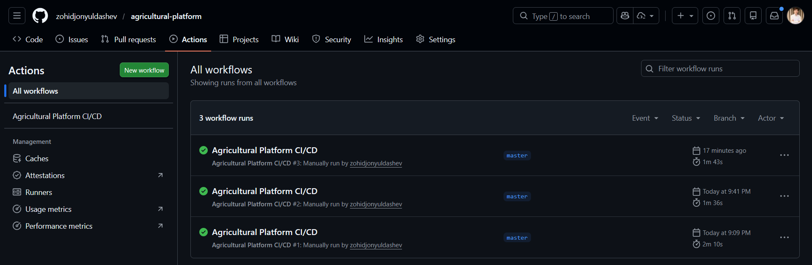
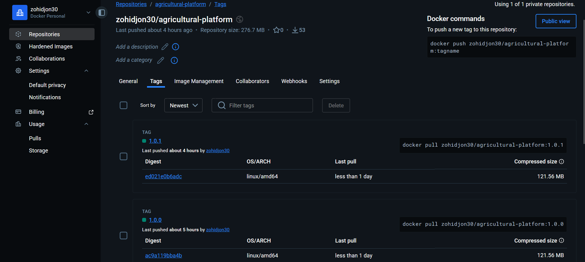
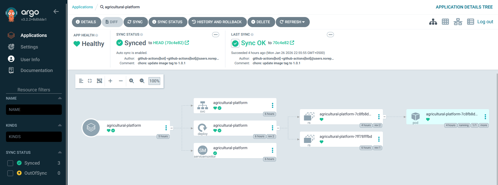
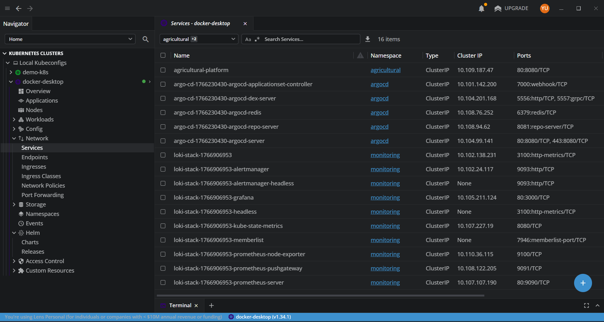
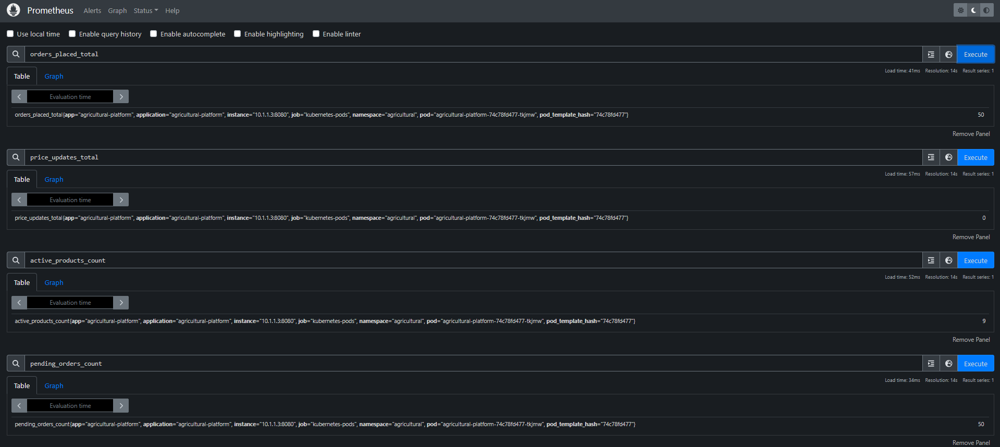
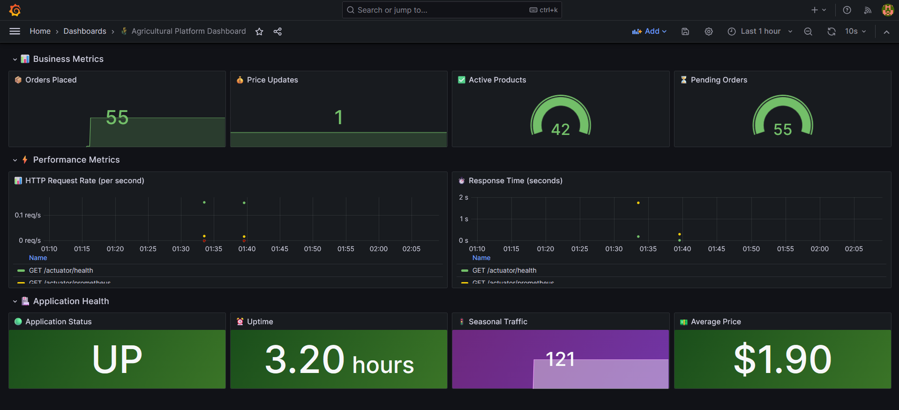
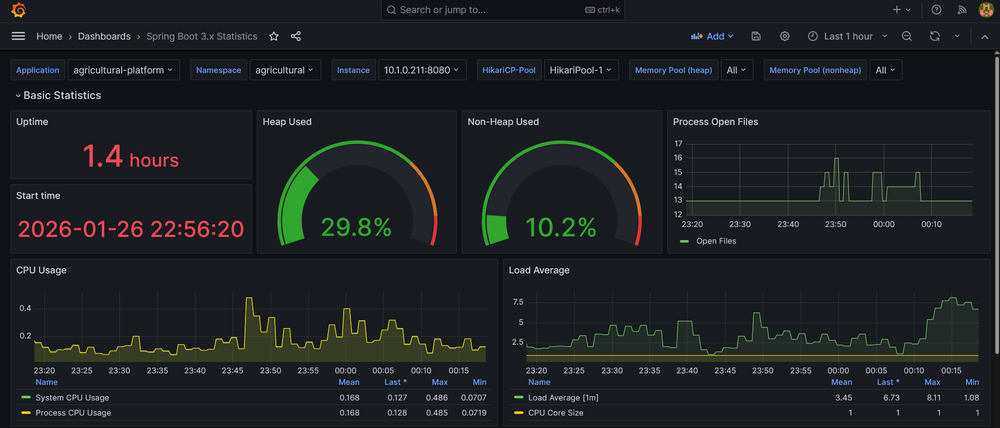
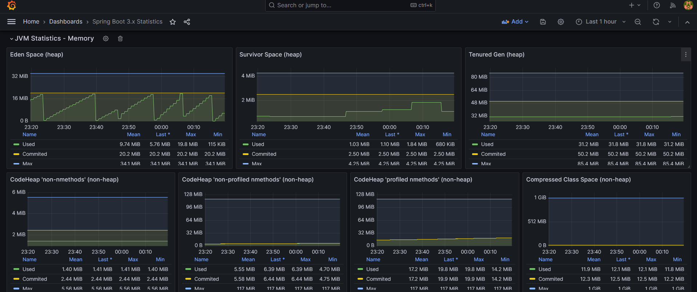
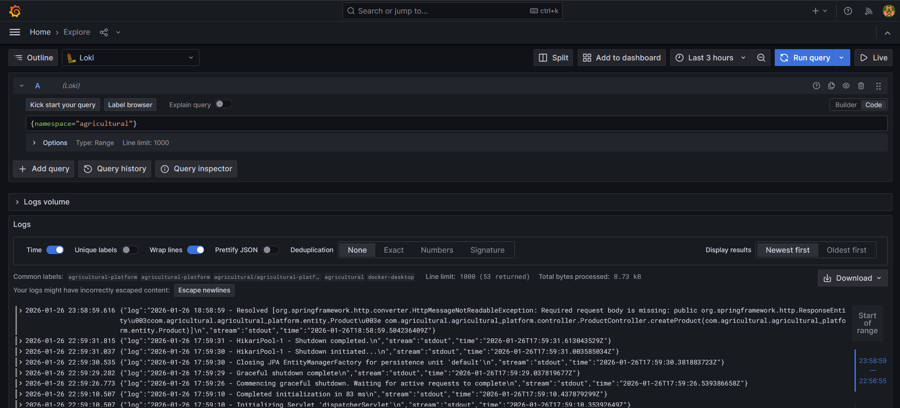

# Agricultural Digital Platform

A Digital Procurement Platform for Agriculture & Food Production built with modern DevOps practices.

## 📋 Project Overview

This platform connects farmers, suppliers, distributors, and food-processing companies through a unified digital ecosystem. It demonstrates the implementation of DevOps practices including CI/CD pipelines, container orchestration, GitOps deployment, and comprehensive monitoring.

| Component            | Technology                |
|----------------------|---------------------------|
| **Backend**          | Java 21, Spring Boot 3    |
| **Database**         | PostgreSQL                |
| **Containerization** | Docker                    |
| **Orchestration**    | Kubernetes                |
| **Package Manager**  | Helm                      |
| **CI/CD**            | GitHub Actions            |
| **GitOps**           | ArgoCD                    |
| **Monitoring**       | Prometheus, Grafana, Loki |

## 🚀 CI/CD Pipeline

The project uses GitHub Actions for Continuous Integration and ArgoCD for Continuous Deployment.

### Pipeline Flow

```
┌──────────────┐    ┌──────────────┐    ┌──────────────┐    ┌──────────────┐
│   Checkout   │───▶│ Maven Build  │───▶│  Run Tests   │───▶│ Docker Build │
└──────────────┘    └──────────────┘    └──────────────┘    └──────────────┘
                                                                    │
                                                                    ▼
┌──────────────┐    ┌──────────────┐    ┌──────────────┐    ┌──────────────┐
│ ArgoCD Sync  │◀───│ Update Helm  │◀───│  Push Image  │◀───│    Login     │
│   (Auto)     │    │  values.yaml │    │  to DockerHub│    │  DockerHub   │
└──────────────┘    └──────────────┘    └──────────────┘    └──────────────┘
```

### GitHub Actions Workflow

### Docker Hub Repository

---

## ☸️ Kubernetes Deployment

The application is deployed to Kubernetes using Helm charts and managed by ArgoCD.

### Helm Chart Structure

```
helm/agricultural-platform/
├── Chart.yaml
├── values.yaml
└── templates/
    ├── deployment.yaml
    ├── service.yaml
    ├── servicemonitor.yaml
    ├── configmap.yaml           
    ├── secret.yaml              
    ├── postgres-deployment.yaml
    ├── postgres-service.yaml
    └── postgres-pvc.yaml
```

### ArgoCD Application

### Kubernetes Resources

## 📊 Monitoring & Observability

The platform implements comprehensive monitoring using the Prometheus-Grafana-Loki stack.

### Custom Metrics

The application exposes the following custom business metrics:

| Metric                            | Type    | Description                       |
|-----------------------------------|---------|-----------------------------------|
| `orders_placed_total`             | Counter | Total number of orders placed     |
| `price_updates_total`             | Counter | Total number of price updates     |
| `active_products_count`           | Gauge   | Currently available products      |
| `pending_orders_count`            | Gauge   | Orders waiting to be processed    |

### Prometheus Metrics

### Custom Grafana Dashboard

### System Resources Dashboard


### Loki Logs

---

## 🔌 API Endpoints

| Endpoint                    | Method | Description                |
|-----------------------------|--------|----------------------------|
| `/api/products`             | GET    | List all products          |
| `/api/products`             | POST   | Create a new product       |
| `/api/products/{id}`        | GET    | Get product by ID          |
| `/api/products/{id}`        | PUT    | Update product             |
| `/api/products/{id}`        | DELETE | Delete product             |
| `/api/orders`               | GET    | List all orders            |
| `/api/orders`               | POST   | Create a new order         |
| `/api/orders/{id}/status`   | PATCH  | Update order status        |
| `/api/prices`               | GET    | List all prices            |
| `/api/prices`               | POST   | Create a new price         |
| `/api/prices/{id}`          | PATCH  | Update price               |
| `/api/prices/{id}/rollback` | POST   | Rollback to previous price |
| `/api/reports/daily`        | GET    | Generate daily report      |
| `/api/reports/health`       | GET    | Get system health          |
| `/actuator/health`          | GET    | Health check endpoint      |
| `/actuator/prometheus`      | GET    | Prometheus metrics         |

## 📁 Project Structure

```
agricultural-platform/
├── .github/
│   └── workflows/
│       └── ci-cd.yaml
├── src/
│   └── main/
│       ├── java/
│       │   └── com/agricultural/platform/
│       │       ├── AgriculturalPlatformApplication.java
│       │       ├── config/
│       │       │   └── MetricsConfig.java
│       │       ├── controller/
│       │       │   ├── ProductController.java
│       │       │   ├── OrderController.java
│       │       │   ├── PriceController.java
│       │       │   └── ReportController.java
│       │       ├── entity/
│       │       │   ├── Product.java
│       │       │   ├── Order.java
│       │       │   └── Price.java
│       │       ├── repository/
│       │       │   ├── ProductRepository.java
│       │       │   ├── OrderRepository.java
│       │       │   └── PriceRepository.java
│       │       └── service/
│       │           ├── ProductService.java
│       │           ├── OrderService.java
│       │           ├── PriceService.java
│       │           └── ReportService.java
│       └── resources/
│           └── application.yml
├── helm/
│   └── agricultural-platform/
│       ├── Chart.yaml
│       ├── values.yaml
│       └── templates/
│           ├── deployment.yaml
│           ├── service.yaml
│           ├── servicemonitor.yaml
│           ├── configmap.yaml
│           ├── secret.yaml
│           ├── postgres-deployment.yaml
│           ├── postgres-service.yaml
│           └── postgres-pvc.yaml
├── Dockerfile
├── pom.xml
└── README.md
```

---

## 🛠️ Local Development

### Prerequisites

- Java 21
- Maven
- Docker Desktop with Kubernetes enabled
- Helm
- kubectl

### Run Locally

```bash
# Build the application
mvn clean package -DskipTests

# Run the application
mvn spring-boot:run

# Access the application
curl http://localhost:8080/actuator/health
```

### Build Docker Image

```bash
# Build image
docker build -t agricultural-platform:latest .

# Run container
docker run -p 8080:8080 agricultural-platform:latest
```

### Deploy to Kubernetes

```bash
# Create namespace
kubectl create namespace agricultural

# Install with Helm
helm install agricultural-platform ./helm/agricultural-platform -n agricultural

# Verify deployment
kubectl get pods -n agricultural
```

---

## 📈 DevOps Practices Demonstrated

| Practice                    | Implementation       |
|-----------------------------|----------------------|
| **Version Control**         | Git with GitHub      |
| **CI/CD**                   | GitHub Actions       |
| **Containerization**        | Docker               |
| **Container Orchestration** | Kubernetes           |
| **Infrastructure as Code**  | Helm Charts          |
| **GitOps**                  | ArgoCD               |
| **Monitoring**              | Prometheus           |
| **Visualization**           | Grafana              |
| **Log Aggregation**         | Loki                 |
| **Health Checks**           | Spring Boot Actuator |
| **Custom Metrics**          | Micrometer           |
---